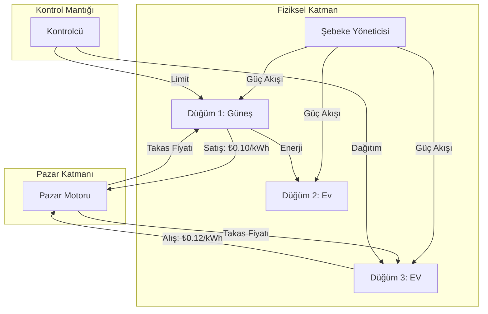

# 🏗️ Sistem Mimarisi

## Genel Bakış
**Energy-Grid-Pulse** sistemi, modüler, olay güdümlü bir simülasyon olarak tasarlanmıştır. **Fiziksel Katmanı** (elektronlar), **Ekonomik Katman** (kuruşlar) ve **Kontrol Katmanından** (bitler) ayırır.

## 🧩 Çekirdek Bileşenler

### 1. Düğüm (Ajan) - The Node
*   **Üreticiler:** Güneş, Rüzgar (Stokastik üretim)
*   **Tüketiciler:** Haneler, Sanayi (Stokastik yük)
*   **Üretüketiciler (Prosumers):** Bataryalar, EV'ler (Çift yönlü)

### 2. Pazar (Borsa) - The Market
*   Çift Taraflı Açık Artırma (Double-Auction) mekanizması.
*   Teklifleri (ödeme istekliliği) ve satış taleplerini (satma istekliliği) eşleştirir.
*   Yerel Marjinal Fiyatı (LMP) belirler.

### 3. Şebeke (Fizik) - The Grid
*   Güç Akışı Analizi.
*   Hat kısıtlamaları ve termal limitler.
*   Voltaj kararlılığı kontrolleri.

## 📊 Diyagram

## Veri Akışı
1.  **Adım 0:** Düğümler üretim/yük tahmini yapar.
2.  **Adım 1:** Düğümler Pazara Alış/Satış teklifleri sunar.
3.  **Adım 2:** Pazar takası gerçekleştirir ve LMP'yi yayınlar.
4.  **Adım 3:** Şebeke Yöneticisi akışları doğrular (tıkanıklık kontrolü).
5.  **Adım 4:** Fiziksel teslimat gerçekleşir (durum güncellemesi).
